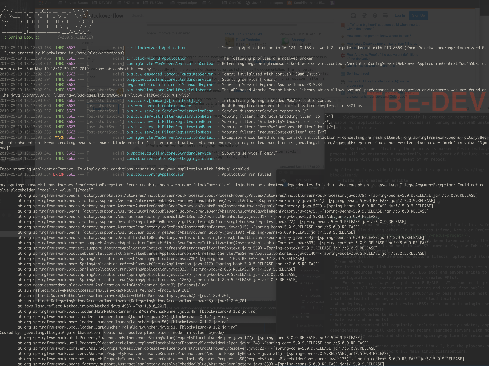

# Blockwizard Deployment
## Files/Directories

   
## Assumptions
- Amazon Linux 2 VM (deployed successfully), VMs are alreadyrunning
- Artifact building process has been taken care of, and stored in Cloud (but upload from local here with all templates)  

## Initialise

Change the following based on your setup

- dev-invemtory/bw.servers.yml
	- ansible_ssh_private_key_file: change based on the ssh key used to log into VM;
	- ansible_host: public ip for ruuning VM
	- ansible_user: the default user used to log into VM (ubuntu/ec2-user/centos)
	
- Edit in roles/proj-bw/vars/main.yml for application related setting: i.e, new release need to change the version number

## Deloyment Steps
Deploy
`ansible-playbook -i ./dev-invemtory/bw.servers.yml bw-deploy.yml`

make sure the VM SG port 16000 is open towards the IP (myip) you are in.

- The application itself must be provisioned using [Ansible](http://ansible.com)
	-all ansible scripts are organised and following ansible framework/best practice.
	 
- The application should not run as a privileged user
	- blockwizard user/group/workingDir is created in remote machine using ansible for application run. The process is ruuning as systemD unite specifying the user.

- The application should automatically be restarted if the app crashes or is killed
	- in SystemD specification, the process is marked `Restart=always`. the process will be restarted automatically in the event of failure. the process also will start in the event of VM reboot.
	   
- Application logs, stdout/stderr should be captured to `/var/log/blockwizard/`
	- folder is created in ansible
	-  the info.log and err.log is created in systemD

However, the application itself is not starting and throw some spring errors. Tried using different settings, no luck. Not sure if it is related to JDK version or not.

 

## Improvements 
- For fully automated CI/CD, use and store built artifacts in a safe location in Cloud using other Cloud services (jfrog, Nexus or ProGet <https://www.praqma.com/stories/artifactory-nexus-proget/>), 
	- Assume artifacts built process already been taken care of, the artifacts can be stored and host in AWS S3 immediately, use IAM role in EC2 VM for the access control.
	- Simple patten: use Jenkins to build artifacts, upload and store them to/from AWS S3. 
- For initial setup Link terraform with ansible: terraform to setup all required resources (VM, IAM role, SG, EBS etc) and envoke anible to start the configuration directly against newly created VM(s).
	- For security, always use pattern: ELB/ALB + VMs (running in private subnets), so all the operations are running and hidden from public Internet. this requires ansible to setup/run by pass a Bastion host from local (instead of running ansible from a Cloud location)
- When deploy, using non-root device (EBS) location and nonlogin user for the application process.
- Use ansible modules to abstract most common tasks (i.e. setup systemd, create user and accounts)
- Build an customised AMI regularly, including security updates, app dependencies. This will keep all the recent launched servers with most recent security patches and shorten the spining-up time for required ENV to set up.
- The scripts are running against Amazon Linux 2, but the playcook should wrote in the way that support all main linux distributions.
- Configure files should also be stored in the Cloud.
- rotate the log file properly if stored in / (root) disk.
- change -Dspring.profiles.active based on VM mode (ansible)
 
